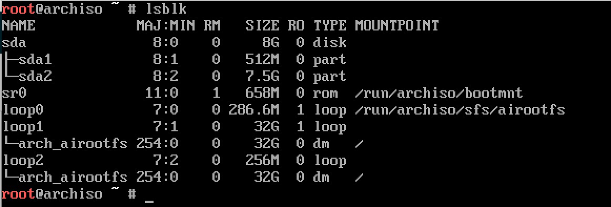

# Arch Linux Guest In VirtualBox

## Getting Started
Before doing anything, download [VirtualBox](https://www.virtualbox.org/wiki/Downloads) 
 and an [Arch Linux iso](https://www.archlinux.org/download/).

[VirtualBox Documentation](https://www.virtualbox.org/manual/UserManual.html)

[Arch Linux Wiki](https://wiki.archlinux.org/)

## VirtualBox

### Creating The Virtual Machine
Open the VirtualBox application and create a new virtual machine.


Enter a name for the virtual machine. Select **Linux** for the type and 
 **Arch Linux (64-bit)** for the version.


Select an amount of memory to allocate to the virtual machine while it's powered on.


Create a new hard disk.


For our purposes we're using **VDI (VirtualBox Disk Image)** as a hard disk type.


Select if you want your hard disk to be a fixed size on the host or dynamically allocated.
 * Fixed size will allocate a folder the size of the hard disk on the host.
 * Dynamically allocated will grow in size as the guest os get's bigger but never shrink.


Name and set the size of the hard disk folder being created on the host.


### Additional Settings
We'll be creating a [UEFI](https://en.wikipedia.org/wiki/Unified_Extensible_Firmware_Interface) 
 boot partition.  We need to tell VirtualBox to boot with EFI. Select the newly 
 created virtual and click on Settings at the top. Navigate to the system tab and 
 check **Enable EFI (special OSes only)**. Hit **Ok** when finished.


Increase the video memory to whatever value you desire. VirtualBox supports either
 2D or 3D acceleration, not both.


Start the virtual. VirtualBox will ask you to privide the arch _.iso_ file to boot from.


## Arch Linux
### Base Installation
#### Detailed Instructions
After you start the virtual, you will need to boot to the iso. Most of these steps
 are taken directly from the Arch Wiki's
 [Beginner's Guide](https://wiki.archlinux.org/index.php/Beginners'_guide).


For partitioning we'll be using 

Use [lsblk](http://linux.die.net/man/8/lsblk) to get the a list of block devices.
 You should see one you created in VirtualBox as _sda_ with the type **DISK**.
 We'll be partitioning it with [sgdisk](http://rodsbooks.com/gdisk/sgdisk.html).
 We use sgdisk because we need to have a [GPT](https://en.wikipedia.org/wiki/GUID_Partition_Table) 
 layout for our boot partition. Read more on [partitioning](https://wiki.archlinux.org/index.php/Partitioning).


Partitioning with sgdisk requires you to know which sectors your partitions will
 begin and end. Each sector is a multiple of 2048 (1 MiB), so a 3 GiB partition 
 will be roughly 6291455 sectors. Luckily sgdisk can do the calculations for us.
 Using the -F and -E options we can determine the first and last sectors available.
 Also, a size can be specified instead of an end sector.

Boot Partition - get the first sector available and create a 512 MiB EFI partition:
```
START_SECTOR=$(sgdisk -F /dev/sda)

sgdisk  -n 1:$START_SECTOR:+512M  -c 1:"EFI"  -t 1:EF00 /dev/sda
```

Root Partition - get the next and last sector available after the boot partition
 and create the root partition:
```
START_SECTOR=$(sgdisk -F /dev/sda)
  END_SECTOR=$(sgdisk -E /dev/sda)

sgdisk  -n 2:$START_SECTOR:$END_SECTOR  -c 2:"ARCH"  -t 2:8300 /dev/sda
```
_Note: partition names do not have to be 'EFI' or 'ARCH'_


Use lsblk again to verify the changes made.



We need to create our [file systems](https://wiki.archlinux.org/index.php/File_systems) 
 by formatting the partitions. The boot partition needs to be FAT32 and root will
 be ext4:
```
mkfs.vfat -F32 /dev/sda1
mkfs.ext4 /dev/sda2
```


Mount the partitions:
```
mount /dev/sda2 /mnt
mkdir /mnt/boot
mount /dev/sda1 /mnt/boot
```

Edit the mirror list (_/etc/pacman.d/mirrorlist_) if needed.  Afterwards install 
 the base system on the root partition.
```
pacstrap /mnt base base-devel
genfstab -U -p /mnt >> /mnt/etc/fstab
```

Chroot into _/mnt_ and run the base installation script. This script will finish
 installing everything you need to have a basic installation of arch linux like
 like installing an EFI boot loader, setting up the locale and timezone. The
 installation includes installing xorg, git, zshell, dwm, vim, and python.

##### Quick Install
Have these steps perform automatically:
```
sh -c "$(curl -fsSL https://raw.github.com/nelsonripoll/arch/master/tools/base_install.sh)"
```

### Post Installation
#### VirtualBox Utils
```
yaourt virtualbox-guest-utils

modprobe -a vboxguest vboxsf vboxvideo

cat > /etc/modules-load.d/virtualbox.conf <<EOF
vboxguest
vboxsf
vboxvideo
EOF
```

#### XDM
```
cp -f arch/config/xdm/Xresources /etc/X11/xdm/Xresources

systemctl enable xdm

mkdir /usr/local/share/wallpapers

cat > /etc/X11/xdm/Xsetup_0 <<EOF
/usr/bin/qiv -zr /usr/local/share/wallpapers/*
EOF
```

#### DWM
```
sudo abs community/dwm
```

```
arch-chroot /mnt /bin/bash
sh -c "$(curl -fsSL https://raw.github.com/nelsonripoll/arch/master/tools/base_install.sh)"
```
