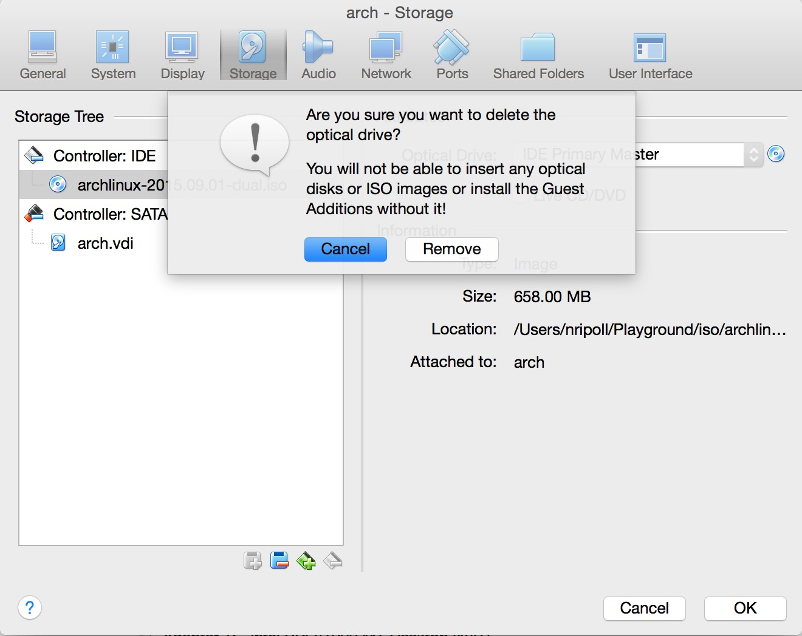

# Arch Linux Guest In VirtualBox

## Getting Started
Before doing anything, download [VirtualBox](https://www.virtualbox.org/wiki/Downloads) 
 and an [Arch Linux iso](https://www.archlinux.org/download/).

[VirtualBox Documentation](https://www.virtualbox.org/manual/UserManual.html)

[Arch Linux Wiki](https://wiki.archlinux.org/)

## VirtualBox

### Creating The Virtual Machine
Open the VirtualBox application and create a new virtual machine.


Enter a name for the virtual machine. Select **Linux** for the type and 
 **Arch Linux (64-bit)** for the version.


Select an amount of memory to allocate to the virtual machine while it's powered on.


Create a new hard disk.


For our purposes we're using **VDI (VirtualBox Disk Image)** as a hard disk type.


Select if you want your hard disk to be a fixed size on the host or dynamically allocated.
 * Fixed size will allocate a folder the size of the hard disk on the host.
 * Dynamically allocated will grow in size as the guest os get's bigger but never shrink.


Name and set the size of the hard disk folder being created on the host.


### Additional Settings
We'll be creating a [UEFI](https://en.wikipedia.org/wiki/Unified_Extensible_Firmware_Interface) 
 boot partition.  We need to tell VirtualBox to boot with EFI. Select the newly 
 created virtual and click on Settings at the top. Navigate to the system tab and 
 check **Enable EFI (special OSes only)**. Hit **Ok** when finished.


Increase the video memory to whatever value you desire. VirtualBox supports either
 2D or 3D acceleration, not both.


Create an optical drive under the storage tab and mount the arch iso.


## Installing Arch Linux
This section is split into two parts: base installation and post installation.
 * Base Installation
  * Partition
  * Format
  * Mount
  * Install
  * Fstab
 * Post Installation
  * Boot Loader
  * Locale
  * Timezone
  * Hardware Clock
  * Hostname
  * Network
  * Initramfs
  
### Base Installation
#### Detailed Instructions
After you start the virtual, you will need to boot to the iso. Most of these steps
 are taken directly from the Arch Wiki's
 [Beginner's Guide](https://wiki.archlinux.org/index.php/Beginners'_guide).

##### Partitioning
Use [lsblk](http://linux.die.net/man/8/lsblk) to get the a list of block devices.
 You should see one you created in VirtualBox as _sda_ with the type **DISK**.
 We'll be partitioning it with [sgdisk](http://rodsbooks.com/gdisk/sgdisk.html).
 We use sgdisk because we need to have a [GPT](https://en.wikipedia.org/wiki/GUID_Partition_Table) 
 layout for our boot partition. Read more on [partitioning](https://wiki.archlinux.org/index.php/Partitioning).

Partitioning with sgdisk requires you to know which sectors your partitions will
 begin and end. Each sector is a multiple of 2048 (1 MiB), so a 3 GiB partition 
 will be roughly 6291455 sectors. Luckily sgdisk can do the calculations for us.
 Using the -F and -E options we can determine the first and last sectors available.
 Also, a size can be specified instead of an end sector.

Boot Partition - get the first sector available and create a 512 MiB EFI partition:
```
START_SECTOR=$(sgdisk -F /dev/sda)

sgdisk  -n 1:$START_SECTOR:+512M  -c 1:"EFI"  -t 1:EF00 /dev/sda
```

Root Partition - get the next and last sector available after the boot partition
 and create the root partition:
```
START_SECTOR=$(sgdisk -F /dev/sda)
  END_SECTOR=$(sgdisk -E /dev/sda)

sgdisk  -n 2:$START_SECTOR:$END_SECTOR  -c 2:"ARCH"  -t 2:8300 /dev/sda
```
_Note: partition names do not have to be 'EFI' or 'ARCH'_

Verify changes made:
```
sgdisk -p /dev/sda
```

##### Format Partitions
We need to create our [file systems](https://wiki.archlinux.org/index.php/File_systems) 
 by formatting the partitions. The boot partition needs to be FAT32 and root will
 be ext4:
```
mkfs.vfat -F32 /dev/sda1
mkfs.ext4 /dev/sda2
```

##### Mount Partitions
Mount the partitions:
```
mount /dev/sda2 /mnt
mkdir /mnt/boot
mount /dev/sda1 /mnt/boot
```

##### Install Arch
Edit the mirror list (_/etc/pacman.d/mirrorlist_) if needed.  Afterwards install 
 the base system on the root partition.
```
pacstrap /mnt base base-devel
```

##### Generate fstab
[fstab](https://wiki.archlinux.org/index.php/Fstab)
```
genfstab -U -p /mnt >> /mnt/etc/fstab
```

#### Quick Install
```
sh -c "$(curl -fsSL https://raw.github.com/nelsonripoll/arch/master/tools/base_install.sh)"
```

### Post Installation
#### Detailed Instructions
Arch Linux is installed but it's not quite ready to boot to just yet. Chroot into
 the root partition to finish up the base installation.
```
arch-chroot /mnt /bin/bash
```

##### Boot Loader
```
bootctl install

cat > /boot/loader/entries/arch.conf <<EOF
title Arch Linux
linux /vmlinuz-linux
initrd /initramfs-linux.img
options root=/dev/sda2 rw
EOF

cat > /boot/loader/loader.conf <<EOF
default arch
timeout 3
EOF
```

##### Locale
```
echo "en_US.UTF-8 UTF-8" > /etc/locale.gen
echo "LANG=en_US.UTF-8" > /etc/locale.conf

locale-gen
```

##### Timezone
```
ln -s /usr/share/zoneinfo/US/Central /etc/localtime
```

##### Hardware Clock
```
hwclock --systohc --utc
```

##### Hostname
```
echo "localhost" > /etc/hostname
```

##### Network
```
systemctl enable dhcpcd@enp0s3.service
```

##### Initial Ramdisk
```
mkinitcpio -p linux
```

##### Set root password
```
passwd
```

##### Create a user
Create your user in the wheel group, then set the passwd.
```
useradd -m -G wheel -s /bin/bash username
passwd username
```

Give the wheel group sudo access
```
cp /etc/sudoers /etc/sudoers.backup

echo "%wheel ALL=(ALL) NOPASSWD: ALL" >> /etc/sudoers
```

That's it, you have a bootable linux os. Exit from chroot.
```
exit
```

#### Quick Install
If you ran the base install script these were already taken care of except the 
 user creation, setting of passwords, and modifying the permissions.
```
sh -c "$(curl -fsSL https://raw.github.com/nelsonripoll/arch/master/tools/post_install.sh)"
```

#### Unmount Partitions & Shutdown
Before you shutdown, make sure you unmount the partitions. The command is **umount**.
```
umount /mnt/boot
umount /mnt

shutdown
```

### Remove iso
Remove the optical drive under the storage tab.



## Desktop Environment
After you boot your machine back up, log in as the created user.
### Arch Packages & Project
```
sudo pacman -S --noconfirm git yajl zsh vim-python3 python-pip xorg-server xorg-xdm xorg-xinit xorg-xdpyinfo qiv abs dmenu rxvt-unicode

git clone https://github.com/nelsonripoll/arch.git /tmp/arch
```

### Yaourt & VirtualBox Utils
#### Yaourt
[Yaourt](https://wiki.archlinux.org/index.php/Yaourt) is a third-party script
 that acts as a wrapper for pacman and makes installing packages from the 
 [AUR](https://wiki.archlinux.org/index.php/Arch_User_Repository). The root 
 user is not allowed to make packages for installing packages from the AUR.
 Create a dummy user in the wheel group and edit the sudoers file to allow wheel
 users to run all commands. Clean up afterwards.
```
git clone https://aur.archlinux.org/package-query.git /tmp/package-query
cd /tmp/package-query
makepkg -i --noconfirm

git clone https://aur.archlinux.org/yaourt.git /tmp/package-query
cd /tmp/yaourt
makepkg -i --noconfirm
```

#### VirtualBox Utils
```
read -r -d '' VBU <<'EOF'
vboxguest
vboxsf
vboxvideo
EOF

yaourt virtualbox-guest-utils

sudo modprobe -a $VBU

sudo echo "$VBU" > /etc/modules-load.d/virtualbox.conf
```

### XDM
```
sudo cp -f /tmp/arch/config/xdm/Xresources /etc/X11/xdm/Xresources

sudo systemctl enable xdm

sudo mkdir /usr/local/share/wallpapers

sudo cp /etc/X11/xdm/Xsetup_0 /etc/X11/xdm/Xsetup_0.backup

sudo sh -c 'echo "/usr/bin/qiv -zr /usr/local/share/wallpapers/*" > /etc/X11/xdm/Xsetup_0'
```

### DWM
```
sudo abs community/dwm

cp -fr /var/abs/community/dwm ~/dwm

cd ~/dwm

makepkg -i
```

### Powerline
```
git clone --depth=1 https://github.com/powerline/fonts.git  /tmp/fonts

curl -L https://github.com/powerline/powerline/raw/develop/font/PowerlineSymbols.otf      -o  /tmp/powerlinesymbols.otf
curl -L https://github.com/powerline/powerline/raw/develop/font/10-powerline-symbols.conf -o  /tmp/11-powerline-symbols.conf

sudo pip install powerline-status

sudo mv /tmp/powerlinesymbols.otf       /usr/share/fonts/powerlinesymbols.otf
sudo mv /tmp/11-powerline-symbols.conf  /etc/fonts/conf.d/11-powerline-symbols.conf
sudo mv /tmp/fonts/*                    /usr/share/fonts/

fc-cache -vf /usr/share/fonts
```

### Home
```
mkdir -pv ~/.vim/colors ~/.vim/bundle

mv -f /tmp/Vundle.vim                                       ~/.vim/bundle/Vundle.vim
mv -f /tmp/oh-my-zsh                                        ~/.oh-my-zsh
mv -f /tmp/arch/config/x11/xinitrc                          ~/.xinitrc
mv -f /tmp/arch/config/x11/Xresources                       ~/.Xresources
mv -f /tmp/arch/config/solarized/solarized_dark.dir_colors  ~/.dir_colors
mv -f /tmp/arch/config/zshell/zshrc                         ~/.zshrc
mv -f /tmp/arch/config/vim/vimrc                            ~/.vimrc
mv -f /tmp/arch/config/solarized/solarized_dark.vim         ~/.vim/colors/solarized.vim
mv -f /tmp/arch/config/dwm/config.h                         ~/dwm/config.h

cd ~/dwm

makepkg -g >> PKGBUILD
makepkg -ief
```

### Change shell
Change your default shell to zshell.
```
chsh -s /bin/zsh
```

### Reboot
```
sudo reboot
```
